<table border="none">
  <tr>
    <td valign="center">
      
    </td>
    <td valign="top">
      
       
      
        
      
      
      
      
    </td>
  </tr>
</table>

---

### 🛠️ **Tech Stack**

**Languages I've learned**

**Languages I'm exploring**

**Daily Tools**

---

### 📊 **GitHub Analytics**

  

   

  

---

### 🎮 **Gaming Stats**

  

  

  

  

  

  

> [!IMPORTANT]
> 🇮🇹 $\rightarrow$ Sto avendo delle idee per vedere se riesco a creare delle card adatte per questi vari giochi
> 
> 🇬🇧 $\rightarrow$ I'm having some ideas to see if I can make some cards suitable for these various games

---

  
  
  

